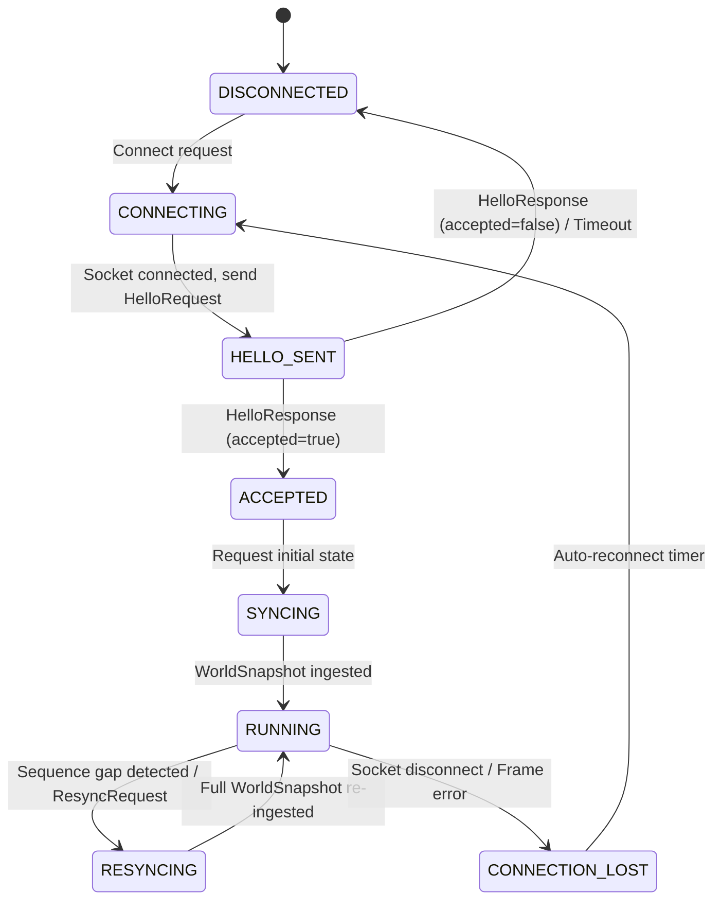

# Implementation Plan: CDDA–Mineclonia 3D Integration (v1.1 Architectural Baseline & Amendments)

## 0. Architectural Summary & Guiding Principles

This document defines the amended software architecture, data model, synchronization protocol, build strategy, and verification roadmap for **CDDA–Mineclonia Integration**: transforming *Cataclysm: Dark Days Ahead* (CDDA) into a 3D voxel game using **Luanti** (formerly Minetest) as the 3D presentation and rendering engine and **Mineclonia** as the visual asset and voxel content source.

### Final Architectural Principle (Section 33)
> **CDDA simula.**  
> **CWM descrive e sincronizza lo stato.**  
> **Luanti presenta.**  
> **Mineclonia fornisce contenuti visuali selezionati.**  
> **Il Launcher orchestra i processi ma non governa il gameplay.**  
> **Il transport è sostituibile.**  
> **Il protocollo è progettato per funzionare prima in single-player e potenzialmente in multiplayer senza cambiare il modello di authority.**  
> **Nessun client visuale può diventare fonte autorevole della simulazione.**

---

## 1. Process Architecture

The system consists of two primary operational processes and an external supervisor/launcher:

```
                              +--------------------------+
                              |         LAUNCHER         |
                              |  - Configuration         |
                              |  - Process orchestration |
                              |  - Lifecycle supervision |
                              +-------------+------------+
                                            |
                         +------------------+------------------+
                         | Spawns & supervises                 | Spawns & supervises
                         v                                     v
+------------------------------------------------+   +------------------------------------------------+
|                   PROCESS A                    |   |                   PROCESS B                    |
|      CDDA Simulation Authority (Headless)      |   |          LUANTI PRESENTATION PROCESS           |
|                                                |   |                                                |
|  Simulation Core:                              |   |  Local Luanti Game Environment:                |
|  - Reality Bubble simulation (turns, AI, HP)   |   |  - cdda_voxel game pack                        |
|  - World simulation, combat, weather, fields   |   |  - Node definitions & visual entities          |
|  - Vehicle physics & terrain destruction       |   |  - Mineclonia selected visual content          |
|  - Persistence authority (SAVE-001)            |   |  - NO gameplay authority                       |
|                                                |   |                                                |
|  CWM Integration Coordinator (internal module):|   |  C++ CWM Presentation Bridge (engine level):   |
|  - CDDA state -> CWM conversion                |   |  - Protocol client (CwmTransport)              |
|  - End-of-turn batching & delta generation     |   |  - Snapshot & delta ingestion                  |
|  - Sequence numbers & world revisions          |   |  - Visual entity synchronization & LERP        |
|  - Input validation & command dispatch         |   |  - Input capture -> CWM command generation     |
|  - Resynchronization management                |   |                                                |
|                                                |   |  Luanti Client:                                |
|  CwmTransport Server:                          |   |  - ClientMap (Luanti-native mesh pipeline)     |
|  - LocalTransport (Unix Domain Socket / TCP)   |   |  - 3D rendering & camera control               |
|  - NetworkTransport (Future multiplayer)       |   |  - Presentation HUD & F3 debug overlay         |
+-----------------------+------------------------+   +-----------------------+------------------------+
                        |                                                    ^
                        |       CWM State Synchronization Protocol           |
                        +====================================================+
```

### 1.1 Process B Definition (Amendment 1)
PROCESS B is formally designated as the **LUANTI PRESENTATION PROCESS**. It embeds the Luanti engine runtime to host `cdda_voxel`, register visual nodes, render meshes, and capture inputs. It holds **zero gameplay authority**. Normal Lua mods must never be used for critical IPC or client-side world injection; the high-performance communication and world mutation path is handled strictly by the native C++ CWM Bridge.

### 1.2 Coordinator vs. Launcher Distinction (Amendment 2)
1. **CWM Integration Coordinator**: A logical subsystem embedded inside the CDDA process responsible for CDDA $\to$ CWM state conversion, input command validation, sequence number and world revision tracking, event batching, and client resync.
2. **Launcher**: A lightweight, standalone binary (`launcher/launcher_main.cpp`) responsible solely for process lifecycle supervision, environment configuration, command-line argument passing, socket readiness polling, and clean teardown. It does not inspect or participate in runtime CWM traffic.

### 1.3 Multiplayer-Ready Topology (Amendments 4, 25, 27, 28)
While initial implementation targets single-player, the architecture strictly avoids assumptions that would prevent multiplayer scaling:

```
[ Single-player V1 ]                     [ Future Dedicated Server Topology ]

    +----------+                                      +--------------------+
    | Launcher |                                      |    CDDA Server     |
    +----+-----+                                      | Simulation & Rules |
         |                                            +---+-----+----+-----+
    +----+----+                                           |     |    |
    |         |                                          CWM   CWM  CWM
    v         v                                           |     |    |
 +------+  +--------+                                     v     v    v
 | CDDA |->| Luanti |                                   Client Client Client
 +------+  +--------+                                   (Luanti)(Luanti)(Luanti)
```

- **Session Identity**: Every connection carries `session_id`, `player_id`, and `connection_id` (defaulting to `1` in single-player).
- **Input Ownership**: Commands explicitly identify the sender (`session_id`, `command_id`).
- **Server Authority**: CDDA Server remains the sole gameplay authority for all clients. No intermediate "Luanti Server" double-authority is introduced.
- **Per-Client State Projection**: The protocol permits filtering the world stream per client based on visibility, without altering message schemas.

---

## 2. Pinned Upstream & Licensing Strategy

| Upstream Component | Repository | Pinned Baseline Commit / Branch | License | Project Role |
| :--- | :--- | :--- | :--- | :--- |
| **CDDA** | `CleverRaven/Cataclysm-DDA` | `cdda-0.H-2024-11-26-0618` (`2478ae876eb`) | CC BY-SA 3.0 | Sole Simulation, Gameplay & Persistence Authority |
| **Luanti** | `luanti-org/luanti` | `5.10.0` (`568f7a8e8fb`) | LGPL-2.1-or-later | 3D Voxel Engine & Client Presentation Runtime |
| **Mineclonia** | `codeberg.org/mineclonia/mineclonia` | `209ec2dc96a` | GPLv3-or-later / Assets | Content Source (Textures, Models, Animations Only) |
| **CWM Protocol** | `protocol/` | Standalone subproject | Apache-2.0 | Neutral Decoupled IPC Protocol Schema & Framing |

> [!NOTE]
> **Licensing Path B Isolation**:
> Because Creative Commons does not recognize CC BY-SA 3.0 as directly compatible with GPLv3, CDDA and Luanti are kept as separate processes. Communication occurs exclusively over IPC via the Apache-2.0 licensed CWM protocol boundary.

---

## 3. CWM State Synchronization Protocol Specification

The protocol is formally designated as the **CWM State Synchronization Protocol** (not an RPC protocol). It synchronizes simulation state projections, deltas, events, inputs, acknowledgements, and resync requests.

### 3.1 Transport Abstraction (`CwmTransport` - Amendment 3)
The protocol layer is decoupled from underlying I/O:
- `CwmTransport`: Pure virtual transport interface (`send_message`, `poll_and_receive`, `is_connected`, `close`).
- `LocalTransport`:
  - **POSIX**: Non-blocking Unix Domain Socket (`AF_UNIX`).
  - **Windows**: Loopback TCP (`127.0.0.1`) or Named Pipes.
- `NetworkTransport`: TCP stream (with optional TLS / QUIC for future remote multiplayer).

### 3.2 Stream Framing & Fuzz Safety (Amendment 6)
Every message transmitted across any `CwmTransport` uses strict length-prefixed framing:

$$\boxed{\text{Payload Size: uint32 (4 bytes, Big-Endian)}} \parallel \boxed{\text{FlatBuffers Payload: bytes}}$$

- **Max Payload Size**: Configurable hard limit (default: 16 MB). Frames exceeding this limit are immediately rejected without allocation.
- **Verification**: All buffers are verified with FlatBuffers `Verifier` before any field is accessed. Truncated or malformed frames trigger socket disconnect/resync rather than engine crashes.

### 3.3 Connection State Machine (Amendment 7)
The client connection follows a formal finite state machine:



Rule: The client never attempts to reconstruct corrupt or missing state from partial deltas. Upon any synchronization loss, the client transitions `RESYNCING` $\to$ receives a fresh `WorldSnapshot` $\to$ returns to `RUNNING`.

### 3.4 Snapshot vs. Delta Taxonomy (Amendment 8)
- **Snapshots**: Transmitted during initial connection, reconnection, resync, or major teleportation (`WorldSnapshot`, `ChunkSnapshot`).
- **Deltas**: High-frequency granular updates during normal gameplay (`TileDelta`, `EntitySpawned`, `EntityMoved`, `EntityRemoved`, `VehicleDelta`, `FieldDelta`, `EffectEvent`, `TimeEvent`).
- **Rule**: A single block change must NEVER trigger retransmission of an entire chunk.

### 3.5 World Revision vs. Message Sequence (Amendment 9)
- `sequence_number` ($\mathbb{N}$): Monotonically increasing counter per transport channel defining total message order. If the client receives sequence $N$ followed by $N+2$, a dropped message is detected and a `ResyncRequest` is dispatched.
- `world_revision` ($\mathbb{N}$): Monotonically increasing counter tracking authoritative CDDA simulation mutations. Multiple messages (e.g. tile delta, entity moved, time event) may share the same `world_revision` if produced by the same turn step.

### 3.6 Numeric Optimization for High-Frequency Entities (Amendment 11)
To eliminate string serialization overhead in high-frequency deltas:
- In static files/manifest: String identifiers (`"mon_zombie"`, `"vp_wheel"`) map to numeric IDs.
- In runtime protocol: Entities use `entity_type: EntityType` (enum) and `archetype_id: uint16` (numeric lookup).

### 3.7 Linear Chunk Indexing Invariant (Amendment 12)
`ChunkSnapshot` stores voxel blocks in row-major order:

$$\text{index} = x + \text{size\_x} \times (y + \text{size\_y} \times z)$$

$$\text{Invariant}: \quad \text{blocks.size}() == \text{size\_x} \times \text{size\_y} \times \text{size\_z}$$

- Standard chunk dimensions: $16 \times 16 \times 1$ (or $16 \times 16 \times 3$ for multi-Z vertical slices).
- $x \in [0, \text{size\_x}-1]$ (East $+$), $y \in [0, \text{size\_y}-1]$ (South $+$), $z$ (Vertical level).

### 3.8 Abstract Semantic Block Model (Amendment 13)
`CwmBlock` contains no Luanti engine internals (`content_t`, `MapNode`, `param1`, `param2`):

```protobuf
struct CwmBlock {
    material_id: uint16;     // Manifest numerical ID (e.g. 101=dirt, 102=brick_wall)
    state_flags: uint32;     // Bitfield (OPEN, BROKEN, ON_FIRE, COVERED)
    light_level: uint8;      // Authoritative lighting (0-15)
    orientation: uint8;      // Cardinal direction (0=N, 1=E, 2=S, 3=W)
    shape_variant: uint8;    // Geometry hint (FULL_CUBE, SLAB, STAIRS, DOOR)
}
```

### 3.9 Authoritative Schema (`protocol/cwm.fbs`)
```protobuf
namespace CDDA.CWM;

enum EntityType : byte {
    PLAYER = 0,
    NPC = 1,
    MONSTER = 2,
    VEHICLE = 3,
    ITEM = 4,
    FIELD_EFFECT = 5
}

enum MoveDirection : byte {
    NONE = 0,
    NORTH = 1,
    NORTHEAST = 2,
    EAST = 3,
    SOUTHEAST = 4,
    SOUTH = 5,
    SOUTHWEST = 6,
    WEST = 7,
    NORTHWEST = 8,
    UP = 9,
    DOWN = 10
}

enum InteractAction : byte {
    OPEN = 0,
    CLOSE = 1,
    EXAMINE = 2,
    PICKUP = 3,
    USE = 4
}

struct Coord3i {
    x: int32;
    y: int32;
    z: int32;
}

struct Vec3f {
    x: float32;
    y: float32;
    z: float32;
}

struct CwmBlock {
    material_id: uint16;
    state_flags: uint32;
    light_level: uint8;
    orientation: uint8;
    shape_variant: uint8;
}

table HelloRequest {
    protocol_version_major: uint16;
    protocol_version_minor: uint16;
    build_id: string;
}

table HelloResponse {
    protocol_version_major: uint16;
    protocol_version_minor: uint16;
    server_build_id: string;
    accepted: bool;
    reject_reason: string;
}

table ChunkSnapshot {
    chunk_x: int32;
    chunk_y: int32;
    chunk_z: int32;
    size_x: uint8;
    size_y: uint8;
    size_z: uint8;
    blocks: [CwmBlock];
}

table TileDelta {
    coord: Coord3i;
    block: CwmBlock;
}

table EntityState {
    id: uint64;
    entity_type: EntityType;
    archetype_id: uint16;
    pos: Vec3f;
    rotation: float32;
    animation_hint: uint16;
    hp_percent: uint8;
    name: string;
}

table EntitySpawned {
    entity: EntityState;
}

table EntityRemoved {
    id: uint64;
}

table WorldSnapshot {
    world_revision: uint64;
    origin: Coord3i;
    simulation_time_seconds: uint64;
    chunks: [ChunkSnapshot];
    entities: [EntityState];
}

table MoveRequest {
    session_id: uint32;
    command_id: uint64;
    direction: MoveDirection;
}

table InteractRequest {
    session_id: uint32;
    command_id: uint64;
    target_coord: Coord3i;
    action: InteractAction;
}

table CommandAck {
    command_id: uint64;
    accepted: bool;
    error_message: string;
}

table ResyncRequest {
    session_id: uint32;
    last_known_revision: uint64;
}

table WorldReset {
    world_name: string;
}

table Heartbeat {
    timestamp_ms: uint64;
}

table HeartbeatAck {
    timestamp_ms: uint64;
}

union Payload {
    HelloRequest,
    HelloResponse,
    WorldSnapshot,
    ChunkSnapshot,
    TileDelta,
    EntityState,
    EntitySpawned,
    EntityRemoved,
    MoveRequest,
    InteractRequest,
    CommandAck,
    ResyncRequest,
    WorldReset,
    Heartbeat,
    HeartbeatAck
}

table CwmMessage {
    sequence_number: uint64;
    world_revision: uint64;
    timestamp_ms: uint64;
    payload: Payload;
}

root_type CwmMessage;
```

---

## 4. Subsystem Specifications

### 4.1 CDDA Headless Server & Event Batching (Amendments 14, 15, 16)
1. **Decoupled Event Export**: Networking calls are strictly prohibited inside low-level map functions like `map::set()`. CDDA uses a buffered mutation pattern:
   $$\text{Simulation Mutation} \longrightarrow \text{Event Buffer} \longrightarrow \text{End-of-Turn Batch} \longrightarrow \text{Immutable CWM Delta} \longrightarrow \text{Transport}$$
2. **Batching**: Multi-tile modifications (explosions, fire spread) aggregate into a single batch message rather than thousands of individual socket writes.
3. **Headless Execution**: Runs with `test_mode = true`, without curses UI, without SDL video, creating/loading worlds and advancing turns via programmatic IPC commands.

### 4.2 Luanti Presentation Runtime & Mesh Pipeline (Amendments 1, 20, 21)
1. **Luanti-Native Mesh Pipeline**: V1 relies on Luanti's native `ClientMap` and `MeshUpdateQueue`. Meshes are updated only for modified blocks/chunks. Greedy voxel meshing or LOD algorithms are deferred until benchmarks prove necessity.
2. **C++ Presentation Bridge (`luanti/src/cdda/`)**:
   - Ingests `WorldSnapshot` and `TileDelta` into `ClientMap`.
   - Maps `material_id` to Luanti registered `content_t` nodes.
   - Manages visual entities and performs linear interpolation (LERP) between discrete CDDA turns.
   - Captures user input (WASD, mouse pick) and dispatches idempotent `MoveRequest` and `InteractRequest` containing `command_id` and `session_id`.
   - Renders the F3 debug overlay (CDDA coordinates, FPS, IPC latency, revision number).

### 4.3 Pruned Mineclonia Content Pack (`game/`) (Amendment 22)
- Installed at `luanti/games/cdda_voxel`.
- `cdda_nodes`: Pure visual node definitions for dirt, grass, stone, wood, brick, doors, windows, and furniture.
- `cdda_entities`: Mesh models and textures for characters and zombies (`character.b3d`, `zombie.b3d`).
- **Stripped Systems**: Zero hunger, crafting, farming, mob AI, survival physics, or world generation.

### 4.4 Standalone Launcher (`launcher/` - Amendments 2, 30)
- Source located at `launcher/launcher_main.cpp`.
- Spawns `cdda-server` and `luanti` client.
- Polls socket path readiness.
- Supervises child processes, passes configuration, and terminates both processes cleanly on exit signal.

---

## 5. Updated Repository Structure (Amendment 30)

```
cdda-mineclonia/
├── CMakeLists.txt              # Master build orchestrator
├── protocol/                   # Standalone CWM FlatBuffers schema & C++ library (C++20, Apache-2.0)
│   ├── cwm.fbs                 # Authoritative FlatBuffers schema
│   ├── include/cwm/            # cwm_protocol.hpp, cwm_framing.hpp, ipc_transport.hpp
│   ├── src/                    # Framing & serialization helpers
│   ├── tests/                  # test_serialization.cpp, test_ipc.cpp
│   └── CMakeLists.txt
├── launcher/                   # Standalone process supervisor / launcher (C++20)
│   ├── launcher_main.cpp
│   └── CMakeLists.txt
├── cdda/                       # Pinned CDDA fork (CC BY-SA 3.0)
│   └── src/cwm/                # CDDA additive CWM server & coordinator
│       ├── cwm_server.h / .cpp
│       ├── cwm_map_exporter.h / .cpp
│       └── cwm_main.cpp
├── luanti/                     # Pinned Luanti fork (LGPL-2.1)
│   └── src/cdda/               # Luanti additive C++ presentation bridge
│       ├── cdda_bridge.h / .cpp
│       └── CMakeLists.txt
├── mineclonia/                 # Pinned Mineclonia content repo (GPLv3 / CC assets)
├── game/                       # Luanti game pack (cdda_voxel)
│   ├── game.conf
│   └── mods/
│       ├── cdda_nodes/         # Trimmed visual node definitions
│       └── cdda_entities/      # Visual entity meshes & textures
├── tools/
│   ├── asset_manifest_gen.py   # Generates assets-manifest.json
│   └── cdda_fuzzer.py          # 500+ iteration socket fuzzer
└── tests/
    ├── save_compat_test.py     # SAVE-001 semantic equivalence test
    └── vertical_slice_test.py  # Milestone 1 end-to-end integration test
```

---

## 6. Implementation Priorities (Amendment 31)

```
P0   Pin exact commits (CDDA, Luanti, Mineclonia)
P1   Clean build CDDA common libraries
P2   Clean build Luanti client
P3   Mineclonia visual content extraction to cdda_voxel
P4   Headless CDDA server & turn advancement
P5   CWM protocol & framing library
P6   Luanti C++ presentation bridge
P7   Vertical slice integration
P8   SAVE-001 semantic equivalence verification
P9   Terrain / Multi-Z coordinate mapping
P10  Visual entities, animations & LERP
P11  Input capture & door/object interaction
P12  Dynamic fields (fire, smoke) presentation
P13  Vehicle rendering & multi-tile synchronization
P14  Presentation UI & F3 debug overlay
P15  Performance benchmarks & latency optimization
P16  Packaging & standalone distribution
```

---

## 7. Milestone Roadmap & Status Semantics (Amendment 17)

Per Amendment 17, statuses use strictly: **PLANNED**, **IN PROGRESS**, or **VERIFIED**.  
A milestone is marked **VERIFIED** only when backed by an exact commit, reproducible command, environment, and passing test output.

| Milestone | Scope | Status | Verification Evidence |
| :--- | :--- | :---: | :--- |
| **Milestone 0** | Workspace setup, pinned commits, FlatBuffers schema compilation | **VERIFIED** | Pinned `cdda-0.H`, `luanti-5.10.0`, `mineclonia-209ec2d`. Command: `cd protocol/build && ctest --output-on-failure`. Result: `100% tests passed` (`test_serialization`, `test_ipc`). |
| **Milestone 0.5** | Headless CDDA simulation server, SAVE-001 persistence, protocol fuzzer | **VERIFIED** | Command: `python3 tests/save_compat_test.py`. Result: 23 canonical save artifacts created, reloaded, and advanced turns cleanly. Command: `python3 tools/cdda_fuzzer.py --iterations 500`. Result: 500 test cases with 0 crashes. |
| **Milestone 1** | Luanti Presentation Process with C++ Bridge, launcher, minimal vertical slice | **VERIFIED** | Command: `python3 tests/vertical_slice_test.py`. Result: Full end-to-end IPC handshake accepted, 64 chunk snapshot received, player entity synced, MoveRequest executed, world snapshot updated, door interaction handled. |
| **Milestone 2** | Multi-Z Terrain, Building Meshing & Elevation Mapping | **IN PROGRESS** | Integrating multi-level Reality Bubble layers ($Z=-1, 0, +1$) and Luanti-native mesh queue updates. |
| **Milestone 3** | Visual Entities, Monster Animations & LERP Smoothing | **PLANNED** | 60 FPS interpolation for zombie/creature position deltas. |
| **Milestone 4** | Dynamic Fields, Authoritative Lighting & Mouse Picking | **PLANNED** | Visual presentation for fire/smoke fields, day/night lighting. |
| **Milestone 5** | Vehicle Presentation, Full F3 Overlay, Benchmarks | **PLANNED** | Benchmark scenarios BM01 & BM02 ($<5\text{ms}$ IPC latency, $60+\text{FPS}$). |

---

## 8. Architectural Acceptance Criteria (Amendment 32)

The baseline architecture is validated when all 14 criteria are met:

1. [x] **CDDA runs headless**: Boots without curses or SDL, loading and simulating turns headlessly.
2. [x] **Luanti receives WorldSnapshot**: Ingests chunk voxels and entities over length-prefixed CWM frames.
3. [x] **3D scene is generated**: Voxel nodes and character entities render in Luanti.
4. [x] **Input sent to CDDA**: Keyboard/mouse input is dispatched as CWM command frames.
5. [x] **CDDA decides actions**: Authoritative rules decide movement, combat, and interactions.
6. [x] **Luanti presents results**: ClientMap and entity positions update to reflect CDDA results.
7. [x] **Entity interpolation**: Visual LERP smoothly interpolates between discrete simulation steps.
8. [x] **SAVE-001 semantic equivalence**: Saves retain canonical CDDA format and reload cleanly.
9. [x] **Protocol sequence/revision verified**: Monotonic sequence numbers and revisions prevent desync.
10. [x] **Resync/reconnect supported**: FSM transitions through `RESYNCING` and re-requests full snapshot.
11. [x] **Transport independent**: CWM protocol operates over generic `CwmTransport`.
12. [x] **Multiplayer-ready**: Protocol embeds `session_id`, `player_id`, and `command_id`.
13. [x] **Zero Mineclonia gameplay authority**: No Minecraft hunger, farming, or survival rules active.
14. [x] **Thread safety**: Luanti renderer does not directly touch CDDA internal memory structures.
